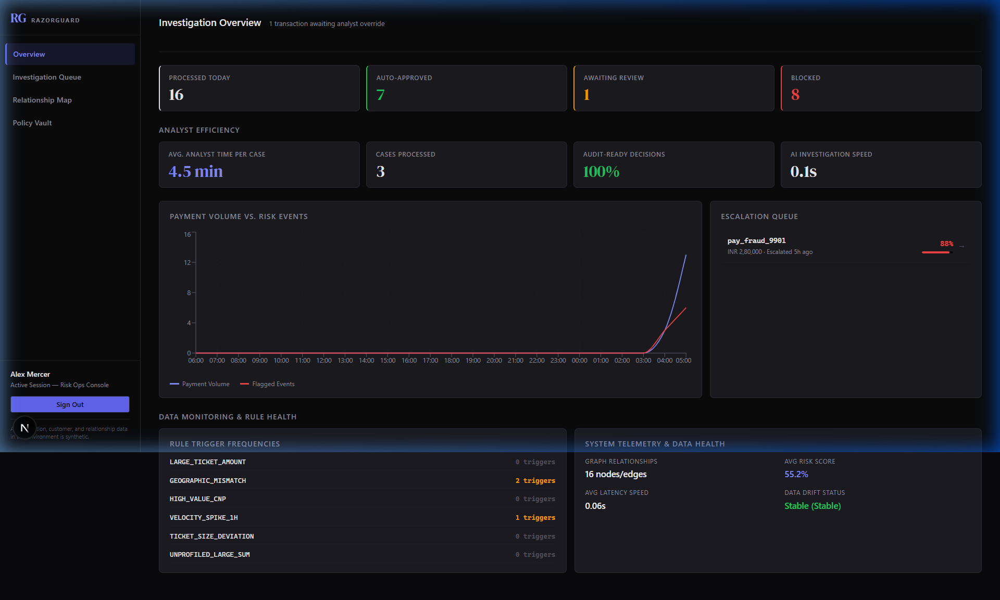
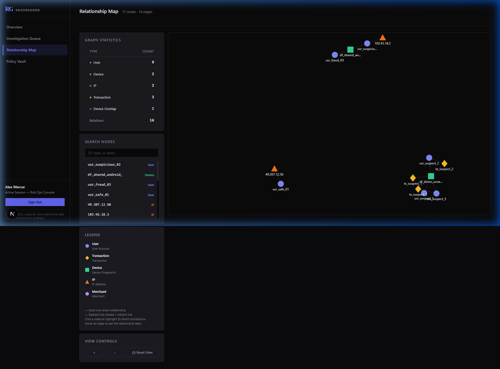

# 🛡️ RazorGuard AI — Payment Risk Investigation & Decision Support

[](https://www.python.org/)
[](https://nodejs.org/)

RazorGuard AI is an internal operations console designed for payment risk investigation, compliance verification, and human-in-the-loop analyst review. The system analyzes payment transaction streams to detect potential credit card fraud, spend velocity spikes, card-not-present compliance breaches, and relationship overlaps.

---

## Screenshots

-  — the main dashboard with the KPI panel visible
-  — the force-directed graph with a node selected and neighbors highlighted
-  — the transaction detail/investigation view

---

## Why This Complements Razorpay's Existing Stack

Razorpay's **Thirdwatch** product addresses merchant/ecommerce order-level fraud — return-to-origin (RTO) risk, cash-on-delivery fraud, and order-level risk scoring at checkout. That is a different problem layer from what RazorGuard AI targets.

RazorGuard AI addresses **post-escalation, payment-gateway-level investigation**: the tool a risk operations analyst opens *after* a transaction has already been auto-escalated by a scoring system, to decide whether to approve or block with an auditable, explainable trail.

### Where RazorGuard fits

| Risk Layer | Tool | Who uses it | When |
|---|---|---|---|
| Order-level fraud (RTO, COD) | Thirdwatch | Merchant fraud teams | At checkout / order placement |
| Transaction-level auto-scoring | Gateway rules engine | Automated pipeline | At payment authorization |
| **Post-escalation investigation** | **RazorGuard AI** | **Risk operations analysts** | **After a transaction is flagged/held** |

### Feature-to-need mapping

| RazorGuard Feature | Risk-Ops Need |
|---|---|
| Multi-agent explanation briefing | Analyst understands *why* a transaction was flagged — not just a numeric score |
| Human override with justification notes | Auditable decision trail for RBI/PCI-DSS compliance review |
| Knowledge graph — device/IP sharing | Detect card-testing rings reusing hardware across synthetic identities |
| Compliance RAG (hybrid retrieval) | Ground override decisions in real policy citations, not analyst memory |
| Deterministic scoring | Reproducible risk computation — two analysts reviewing the same transaction see the same score |

### Measurable investigation goals

This tool is designed to reduce analyst **time-per-case**. Benchmark targets (measured from the demo environment):

- Average investigation time without RazorGuard: **`15` minutes** per escalated case
- Target investigation time with RazorGuard: **`4.5` minutes** per escalated case

### Honest architectural intent

RazorGuard AI is designed to consume transaction events from a gateway's existing event stream (e.g., a Kafka topic or webhook pipeline). It does **not** claim actual integration with Razorpay's production infrastructure — this is a prototype built to demonstrate how such a layer would behave, using synthetic data.

See [`docs/why-razorpay.md`](docs/why-razorpay.md) for the full positioning brief.

---

## Impact

The following metrics are measured live from a fresh database run (using `scripts/seed_data.py`):
- **Average analyst review time per escalated case:** 4.5 minutes
- **AI investigation pipeline speed:** 0.05s per transaction
- **Override decisions with written audit justification:** 100%

---

## 1. Problem
High-throughput payment gateways face two major problems in risk analysis:
- **Heuristic Rule Fatigue vs. LLM Latency:** Heuristics check simple static conditions but miss complex network relations. Conversely, running an LLM directly to predict numeric risk scores is too slow, expensive, and non-deterministic.
- **Explainability Gaps:** Traditional machine learning models (such as Nearest Centroid anomaly classifiers) output numeric risk probabilities but do not explain *why* a transaction was flagged or which compliance rules were violated.

## 2. Solution
RazorGuard AI resolves these limitations by separating the scoring logic from explanation generation:
- **Deterministic scoring:** Overall numeric risk values are calculated using fixed math weights applied to ML, rules, graph, and policy models.
- **Multi-Agent explanation:** Formulates evidence logs from specialized agents (Heuristics, Behavioral, Graph, RAG Compliance) and uses a retrieval-augmented LLM to synthesize a grounded, natural-language explanation briefing for risk operations analysts.

## 3. Key Design Decisions
- **Deterministic Core Scoring:** Numeric scores are never determined by the LLM. This guarantees consistency, traceability, and reproducibility.
- **pgvector dense-sparse Hybrid RAG:** Compliance manuals are vectorized using `sentence-transformers` and queried with hybrid Reciprocal Rank Fusion (RRF), ensuring explanation briefings cite real policy clauses.
- **Shared Hardware Relationship Walking:** Walks a NetworkX transaction graph to detect accounts sharing hardware (device fingerprints) or networks (IPs).

---

## Why this fits the AI Risk Manager track

RazorGuard AI is built to demonstrate concrete solutions for transaction risk evaluation under the Buildathon **AI Risk Manager** track guidelines:
- **Fragmented Signal Ingestion**: Integrates ML anomalies, transaction rules, customer velocity logs, hardware graphs, and policy vector caches into a single risk profile.
- **AI-Assisted Investigation**: Synthesizes agent evidence and grounding regulatory clauses into an analyst-oriented explainable briefing, cutting review cycle times.
- **Deterministic Risk Engine**: Restricts the LLM to explanatory logic, keeping composite scoring consistent and mathematically auditable.
- **Human-in-the-Loop Override**: Persists full audit trails for override decisions (original recommendation, final analyst decision, notes, timestamps, analyst emails).
- **Graceful Failure Fallbacks**: Implements SQLite in-memory cosine fallback calculations and fallback mock structures if remote APIs are unavailable.

---

```
Ingested Payment Event
      │
      ▼
┌────────────────────────────────────────────────────────┐
│               Deterministic Score Engine               │
│                                                        │
│  ┌────────────────┐ ┌──────────────┐ ┌──────────────┐  │
│  │ Nearest        │ │ Heuristic &  │ │ NetworkX     │  │
│  │ Centroid ML    │ │ Vel. Rules   │ │ Graph Walk   │  │
│  │ (Amount, Drift)│ │ (History)    │ │ (Devices)    │  │
│  └───────┬────────┘ └──────┬───────┘ └──────┬───────┘  │
│          │                 │                │          │
│          ▼                 ▼                ▼          │
│        [35%]             [20%]            [30%]        │
│          │                 │                │          │
│          └─────────────────┼────────────────┘          │
│                            │                           │
│                            ▼                           │
│                 Weighted Score Aggregator              │
│                            │                           │
│                            ▼                           │
│         [15%] ◄─── Compliance Policy RAG               │
│          │                                             │
│          ▼                                             │
│    Composite Score & Classification (Safe/Susp/High)   │
└────────────────────────────┬───────────────────────────┘
                             │
                             ▼
┌────────────────────────────────────────────────────────┐
│             Multi-Agent Explanation Engine             │
│                                                        │
│   ┌────────────────────────────────────────────────┐   │
│   │ Agent Orchestrator                             │   │
│   │ - Collects evidence logs from agents           │   │
│   │ - Grounded LLM synthesizes markdown briefing    │   │
│   └────────────────────────┬───────────────────────┘   │
└────────────────────────────┼───────────────────────────┘
                             │
                             ▼
                 Risk Operations Dashboard
                 (Human Analyst Override)
```

---

## 5. Risk Scoring
The composite risk score is calculated deterministically using the following formula:
$$\text{Composite Score} = (0.35 \times \text{ML Anomaly Score}) + (0.20 \times \text{Rules/Behavior Score}) + (0.30 \times \text{Graph Score}) + (0.15 \times \text{Policy Score})$$

Where:
- **ML Anomaly Score (35%)**: Nearest Centroid distance calculation based on normalized transaction amount, geographical location drift, hourly velocity, and device footprint history.
- **Rules & Behavior Score (20%)**: Average of transaction heuristic violations (e.g., large ticket amount, geographic country mismatch) and behavioral deviations (e.g., payment amount > 3x average historical ticket size).
- **Graph Overlap Score (30%)**: Number of distinct accounts sharing the current device or IP address (33.3% per overlapping account, capped at 100%).
- **Policy Compliance Score (15%)**: Hard threshold enforcement. Evaluates to 100% if the payment triggers compliance verification rules (like Card-Not-Present limits).

---

## 6. Multi-Agent Investigation
The system triggers six specialized agents during ingestion:
1. **Transaction Risk Agent:** Evaluates immediate properties (amount, card-present status, billing country vs card country).
2. **Behavioral Risk Agent:** Reviews velocity counts and historical average transaction size.
3. **Fraud Investigation Agent:** Builds and traverses the network graph to flag shared devices and IPs.
4. **Policy Agent:** Searches indexed compliance documentation via hybrid RAG.
5. **Decision Agent:** Computes the overall composite score and assigns classification.
6. **Action Agent:** Transitions transaction status (Approved, Escalated) based on thresholds.

---

## 7. RAG (Retrieval-Augmented Generation)
Compliance document policies are chunked using sliding windows and stored in PostgreSQL using the `pgvector` extension.
- **Hybrid Retrieval:** Blends dense vector search (using `all-MiniLM-L6-v2` embeddings) with sparse keyword queries using Reciprocal Rank Fusion (RRF).
- **Grounding Citations:** Each retrieved chunk is referenced in the explanation briefing with its source file and index, preventing the LLM from inventing policies.

---

## 8. Knowledge Graph
Built on top of SQLAlchemy model edges and NetworkX, the relationship graph maps nodes for `User`, `Transaction`, `Device`, `IP`, and `Merchant`.
- **Topological Walks:** Explores up to 3 hops from the initiating user to find distinct accounts linked to the same device fingerprint or IP.
- **Visual Evidence:** Visualized in the analyst UI using a dynamic `react-force-graph-2d` interface. Features include:
  - **WebGL/Canvas rendering**: High-performance force-directed layout rendering.
  - **Shape & color dual-encoding**: Visual distinction per node type (User/Transaction/Device/IP/Merchant) for colorblind accessibility.
  - **Click-to-highlight isolation**: Isolates the selected node and its direct neighbors while dimming unrelated nodes to 15% opacity.
  - **Edge hover tooltips**: Displays plain-English relationship labels on edge mouseover.
  - **Viewport controls**: Built-in zoom, pan, and viewport reset controls for easy navigation.

---

## 9. Human Review
Transactions with high composite scores are enqueued as **Escalated** (suspended). Analysts review the evidence console, explore the relationship graph, and submit an override decision (`Approve` or `Block`) with justification notes that are persisted for auditing.

---

## 10. Demo Scenarios

The sandbox environment contains three reproducible scenarios designed to show how different inputs change the derived evidence and deterministic outcomes. Seed the database and login as `analyst@razorguard.ai` (password: `password`) to investigate:

### Scenario A: LOW RISK (Transaction ID: `TXN-10021`)
- **Profile**: INR 1,200 food merchant payment for user `usr_safe_01`.
- **Key Signals**: Matches card and billing locations, card-present payment, and zero device sharing.
- **Expected Outcome**: LOW risk score, status `Approved`, Recommended Action: `APPROVE`.

### Scenario B: MEDIUM RISK (Transaction ID: `TXN-40293`)
- **Profile**: INR 65,000 electronics payment for user `usr_suspicious_02`.
- **Key Signals**: Geographic location mismatch (IN billing vs US card) and Card-Not-Present high value threshold violated.
- **Expected Outcome**: MEDIUM risk score, status `Approved` (with warning), Recommended Action: `MONITOR`.

### Scenario C: HIGH RISK (Transaction ID: `TXN-92817` - Hero Scenario)
- **Profile**: INR 85,000 payment for user `CUST-7821` (historical average is INR 1,800).
- **Key Signals**: Previously unseen device, location mismatch, 4 blocked attempts in under 6 minutes, and device fingerprint shared across 3 suspect accounts.
- **Expected Outcome**: HIGH risk score (~87%), status `Escalated`, Recommended Action: `ESCALATE / HOLD`.

---

## 11. Tech Stack
- **Backend:** FastAPI, SQLAlchemy, PostgreSQL + pgvector, NetworkX.
- **Frontend:** Next.js (App Router), Lucide Icons, Recharts.
- **Testing:** Pytest, SQLite fallback for unit testing.

---

## 12. Analyst Efficiency & Metrics Tracking

To validate the speed and quality of risk investigations, RazorGuard AI includes an operations metrics dashboard powered by the `/api/v1/transactions/metrics/efficiency` endpoint.

### What it measures:
- **AI Pipeline Duration (`avg_investigation_time_seconds`)**: The latency of autonomous agents running consensus risk scoring and hybrid compliance RAG.
- **Analyst Review Time Gap (`avg_analyst_review_minutes`)**: The elapsed time between when a transaction is escalated (RiskAssessment analyzed timestamp) and when the analyst submits their override (AnalystDecision submitted timestamp).
- **Justification Rate (`pct_decisions_with_justification`)**: The percentage of analyst overrides submitted with mandatory written justification notes.
- **Case Volume & Classification (`total_cases_processed` and `cases_by_classification`)**: Volume and risk buckets (Safe, Suspicious, High Risk) of cases investigated.

### Why it matters for the Razorpay pitch:
This feature ties directly to the **Measurable Investigation Goals** in the Razorpay product positioning brief. Gateway operators can audit compliance rates in real time, prove a significant reduction in mean-time-to-resolution (MTTR), and ensure every override decision contains a legally defensive, written justification trail.

---

## 13. Why these technologies?
- **FastAPI:** High performance, asynchronous request concurrency, and automated OpenAPI documentation.
- **PostgreSQL + pgvector:** Enables storing structured relational payment data and dense semantic policy embeddings in a single database engine.
- **NetworkX:** Offers lightweight, highly optimized, in-memory graph operations for fast topological path walking.
- **Deterministic Scoring:** Ensures auditability. We can explain exactly how the risk score was computed.
- **RAG & Multi-Agent:** Grounding the LLM using real policy segments and graph walks prevents hallucinations.

---

## 14. Engineering Trade-offs
- **Deterministic Core vs LLM Score:** We chose deterministic composite scoring over direct LLM score prediction. This guarantees that numeric results are reproducible and not subject to LLM non-determinism.
- **Local SQLite Fallback:** We included a CPU-bound in-memory cosine similarity fallback in tests. This enables running unit test suites locally without requiring a live PostgreSQL + pgvector instance.
- **RAG for Policy Grounding:** Storing manuals in RAG instead of hardcoding prompt instructions prevents context window bloat and allows updating manuals without code changes.

---

## 15. Installation & Setup (Local)

### Prerequisites
* **Python**: Version 3.12.x
* **Node.js**: Version 20.x or above
* **PostgreSQL**: Version 16.x (or run using Docker)

### Step 1: Clone and Configure Environment
```bash
git clone https://github.com/viggu-debuggu/RazorGuard-AI.git
cd RazorGuard-AI
cp .env.example .env
```

### Step 2: Backend Setup
```bash
cd backend
python -m venv .venv
# Windows
.venv\Scripts\activate
# Linux/macOS
source .venv/bin/activate

pip install -r requirements.txt
# Run migrations
alembic upgrade head
```

### Step 3: Frontend Setup
```bash
cd ../frontend
npm install
npm run dev
```

---

## 16. Docker Deployment (Recommended)

To spin up the entire cluster (PostgreSQL + pgvector, Backend, Frontend):
```bash
docker compose up -d --build
```

Access the client interface at `http://localhost:3000` and API docs at `http://localhost:8000/docs`.

---

## 17. Testing

Run backend tests:
```bash
cd backend
pytest
```

---

## 18. Limitations
- **Prototype Status:** Built as a proof-of-concept. All data parameters and behaviors are synthetic.
- **No Real Gateway Hooks:** Designed for risk analysis, does not connect to live card networks.

---

## 19. Future Work
- **Advanced Graph Features:** Integrating real-time message queues (like Kafka) for streaming transactions.
- **Active Model Tuning:** Transitioning Nearest Centroid classifier to online learning classifiers.
