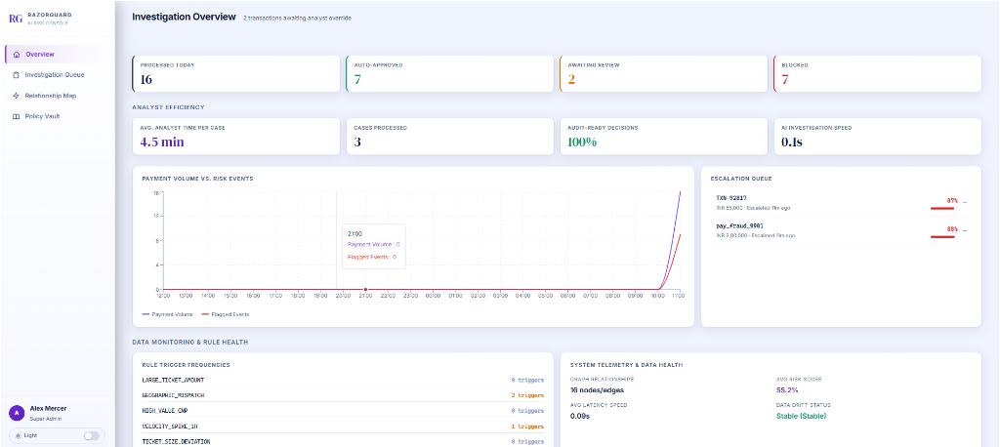
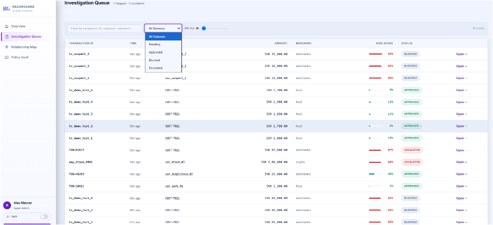
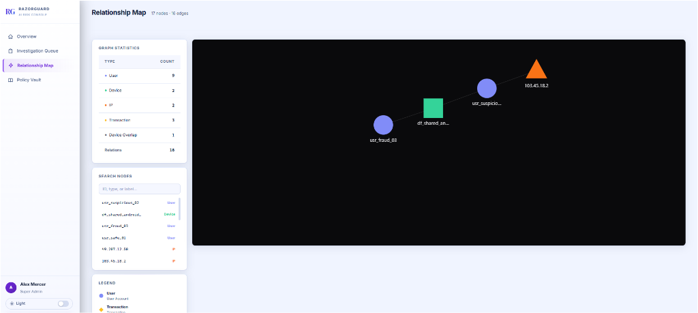
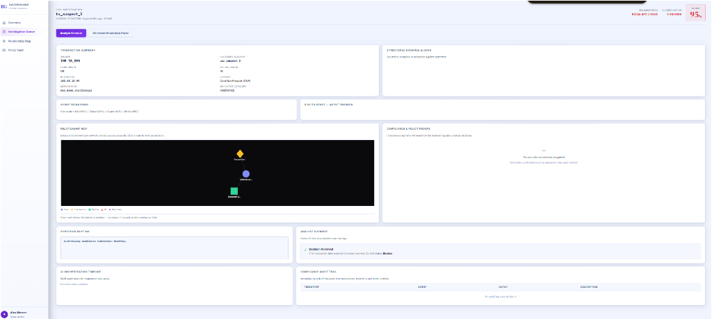
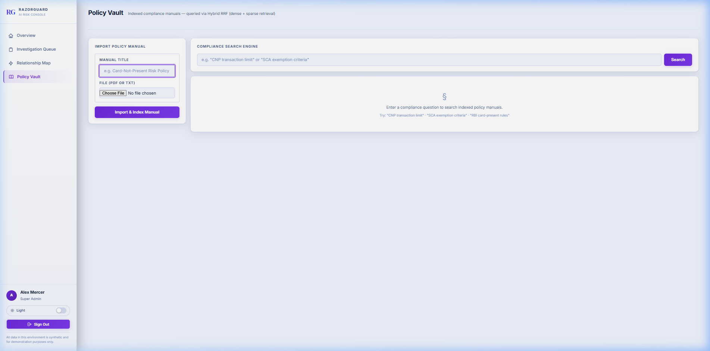
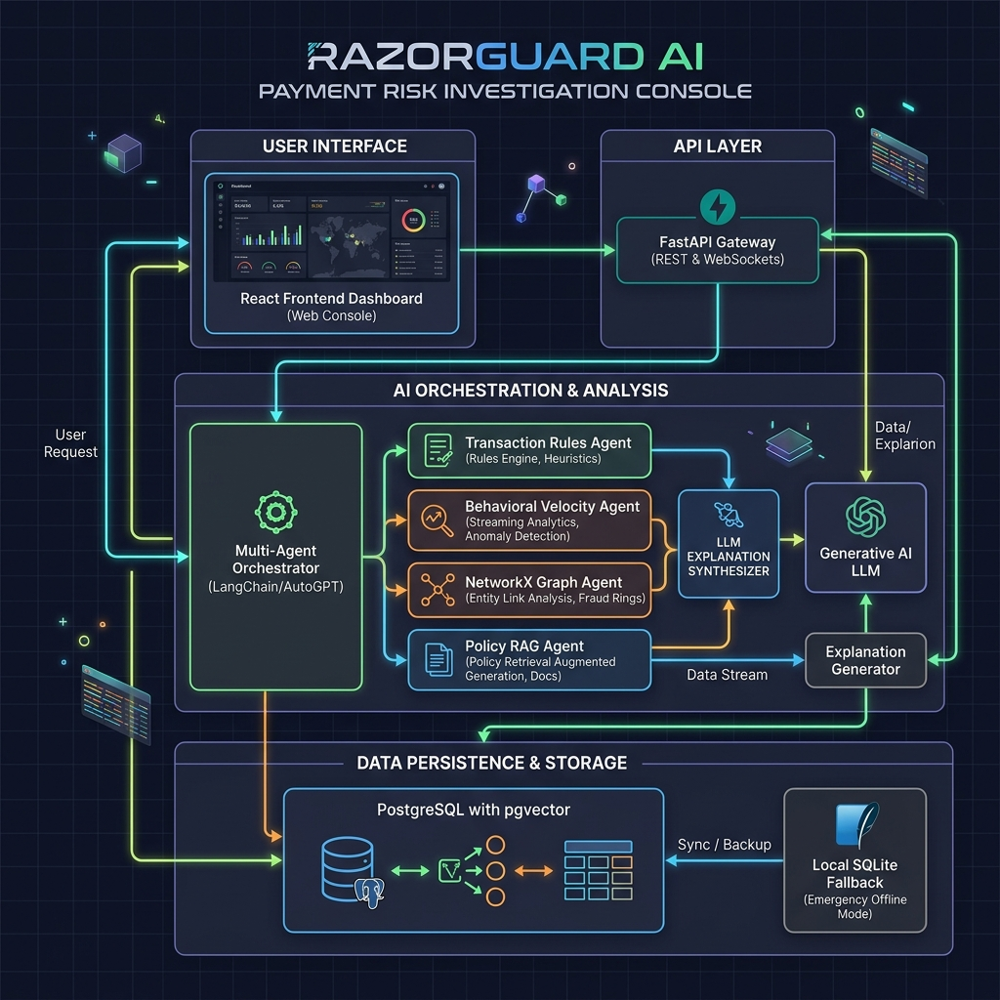

# 🛡️ RazorGuard AI — Payment Risk Investigation & Decision Support

[](https://github.com/viggu-debuggu/RazorGuard-AI/actions/workflows/ci.yml)
[](LICENSE)
[](https://www.python.org/)
[](https://nodejs.org/)

High-throughput payment gateways lose millions to fraudulent transactions every year, yet risk operations teams are overwhelmed by high false-positive alert rates. Traditional machine learning and static rule engines flag suspicious transactions as raw risk scores without explaining *why* a payment was flagged or which compliance rules were violated. This forces fraud analysts to waste critical minutes manually digging through fragmented logs, historical records, and policy manuals for every escalated payment. RazorGuard AI solves this by separating deterministic risk scoring from natural-language explanation, combining multi-signal anomaly detection with an evidence-grounded AI agent that generates audit-ready compliance briefings.


## 💡 Business Impact & Value for Risk Operations

RazorGuard AI translates complex multi-layered data into clear operational outcomes for payment providers like Razorpay:

* **Accelerated Analyst Review Time**: Instead of requiring human analysts to manually inspect device logs, IP histories, database records, and regulatory manuals across multiple tools, RazorGuard AI automatically aggregates evidence into structured markdown briefings. By delivering grounded key factors alongside exact policy citations upfront, analyst investigation times are drastically reduced. *(Note: Review time acceleration metrics are illustrative estimates based on prototype workflow streamlining, not live production benchmarks).*
* **Reduced False-Positive Escalations**: Single-signal rule triggers (such as flagging every high-value or out-of-country transaction) flood operations queues with legitimate payments. RazorGuard AI fuses four distinct signals—Nearest Centroid ML anomaly detection, behavioral velocity rules, NetworkX graph relationship walks, and RAG policy matching—to filter out false alarms and only escalate multi-factor risk anomalies.
* **Auditability & Regulatory Defense**: Regulatory compliance mandates that risk management decisions must be transparent, reproducible, and explainable. RazorGuard AI guarantees mathematical determinism for scoring ($0.35 \times \text{ML} + 0.20 \times \text{Rules} + 0.30 \times \text{Graph} + 0.15 \times \text{Policy}$) and pairs every score with exact RRF-retrieved policy chunk citations (`pgvector` / SQLite RAG) and immutable analyst override audit logs.

---

## The Gap in Current Risk Infrastructure

Across modern payment gateways processing millions of transactions daily, fraud and risk infrastructure typically relies on two disjoint systems: high-throughput machine learning models that emit opaque numerical risk scores (e.g., `0.87`), and hardcoded rule engines executing isolated if/else checks. While fast, this decoupled architecture creates systemic operational blind spots across the industry:

1. **Lack of Decision Traceability**: A numerical score or static alert does not explain *why* a payment was escalated. Human analysts must spend 5–10 minutes cross-referencing telemetry, IP logs, and compliance manuals just to understand the root cause.
2. **Per-Transaction Isolation**: Standard risk pipelines evaluate transactions independently. Distributed fraud rings—sharing device fingerprints, bank cards, or subnets across dozens of synthetic merchant or consumer accounts—slip past per-event velocity filters.
3. **Manual Compliance Assembly**: When regulators or dispute teams request audit trails, risk teams must manually reconstruct evidence snapshots, citation clauses, and justification notes post hoc.

RazorGuard AI was architected specifically to bridge these gaps. By unifying nearest-centroid ML scoring, graph relationship traversal, and retrieval-augmented compliance grounding into a deterministic, multi-agent evaluation pipeline, it transforms raw signals into structured, auditable evidence records at ingestion time.

---

## Why This Matters for Razorpay's Risk Operations

- **KYC & Onboarding Compliance monitoring needs explainable analytics, not black-box risk scores.** RazorGuard AI computes a composite score and maps structured findings directly to database evidence records: [`backend/app/services/agent_team.py:L380-L421`](file:///c:/Users/vigne/Downloads/portfolio/Razorgourd%20Ai/backend/app/services/agent_team.py#L380-L421) runs a consensus rules model, which [`backend/app/services/agent_orchestrator.py:L247-L288`](file:///c:/Users/vigne/Downloads/portfolio/Razorgourd%20Ai/backend/app/services/agent_orchestrator.py#L247-L288) maps to structured database evidence. This gives risk managers absolute visibility into the scoring criteria for onboarding audits.
- **Cross-account fraud rings sharing devices/cards need relationship analysis, not just isolated per-transaction scoring.** Our NetworkX graph walk solves this: [`backend/app/services/agent_team.py:L229-L265`](file:///c:/Users/vigne/Downloads/portfolio/Razorgourd%20Ai/backend/app/services/agent_team.py#L229-L265) executes topological walks on the relational graph built in [`knowledge_graph/network_builder.py`](file:///c:/Users/vigne/Downloads/portfolio/Razorgourd%20Ai/knowledge_graph/network_builder.py) to flag accounts linked through shared hardware fingerprints or network nodes, exposing card-testing networks instantly.
- **Fraud incident reports for regulators need traceable, reproducible decisions.** Our determinism guarantee (validated in [`tests/test_deterministic_scoring_validation.py`](file:///c:/Users/vigne/Downloads/portfolio/Razorgourd%20Ai/tests/test_deterministic_scoring_validation.py)) and pgvector hybrid RAG citations resolve this: regulatory chunks are queried in [`backend/app/ai/vector_store.py`](file:///c:/Users/vigne/Downloads/portfolio/Razorgourd%20Ai/backend/app/ai/vector_store.py) and cited directly down to the source file name and chunk index. This makes audit traces fully transparent and reproducible.
- **Analyst override decisions need a defensible audit trail.** Our override endpoint solves this: [`backend/app/api/endpoints/transactions.py:L368-L452`](file:///c:/Users/vigne/Downloads/portfolio/Razorgourd%20Ai/backend/app/api/endpoints/transactions.py#L368-L452) locks in analyst notes, custom justification text, exact database timestamps, and actor identifiers inside immutable audit logs. This provides legally defensive compliance records.

---

## 📸 Platform Screenshots

<div align="center">

| **Analyst Operations Dashboard** | **Investigation Queue & Filtering** |
| :---: | :---: |
|  |  |
| *Real-time KPI overview, risk telemetry, volume vs risk event trends, and active escalation queue* | *Multi-status filtering, risk score thresholds, and transaction feed* |

<br />

| **Force-Directed Relationship Map** | **Analyst Deep Investigation Console** |
| :---: | :---: |
|  |  |
| *Interactive entity linkage mapping shared devices, IPs, and fraud rings* | *Multi-agent evidence breakdown, compliance policy proofs, and human analyst override controls* |

<br />

| **Merchant Resolution Portal** | **Compliance Policy Vault (Hybrid RAG)** |
| :---: | :---: |
|  |  |
| *Transparent hold explanations, resolution checklist, and merchant document upload* | *Indexed regulatory manuals, semantic vector search, and chunk citations* |

</div>

---

## 🏗️ Architecture Overview

<div align="center">
  
</div>

<br />

<details>
<summary><b>🔍 View Detailed Dataflow Diagram (ASCII)</b></summary>

```
Ingested Payment Event
      │
      ▼
┌────────────────────────────────────────────────────────┐
│               Deterministic Score Engine               │
│                                                        │
│  ┌────────────────┐ ┌──────────────┐ ┌──────────────┐  │
│  │ Nearest        │ │ Heuristic &  │ │ NetworkX     │  │
│  │ Centroid ML    │ │ Vel. Rules   │ │ Graph Walk   │  │
│  │ (Amount, Drift)│ │ (History)    │ │ (Devices)    │  │
│  └───────┬────────┘ └──────┬───────┘ └──────┬───────┘  │
│          │                 │                │          │
│          ▼                 ▼                ▼          │
│        [35%]             [20%]            [30%]        │
│          │                 │                │          │
│          └─────────────────┼────────────────┘          │
│                            │                           │
│                            ▼                           │
│                 Weighted Score Aggregator              │
│                            │                           │
│                            ▼                           │
│         [15%] ◄─── Compliance Policy RAG               │
│          │                                             │
│          ▼                                             │
│    Composite Score & Classification (Safe/Susp/High)   │
└────────────────────────────┬───────────────────────────┘
                             │
                             ▼
┌────────────────────────────────────────────────────────┐
│             Multi-Agent Explanation Engine             │
│                                                        │
│   ┌────────────────────────────────────────────────┐   │
│   │ Agent Orchestrator                             │   │
│   │ - Collects evidence logs from agents           │   │
│   │ - Grounded LLM synthesizes markdown briefing    │   │
│   └────────────────────────┬───────────────────────┘   │
└────────────────────────────┼───────────────────────────┘
                             │
                             ▼
                 Risk Operations Dashboard
                 (Human Analyst Override)
```

</details>

The system triggers six specialized agents during ingestion:
1. **Transaction Risk Agent:** Evaluates immediate properties (amount, card-present status, billing country vs card country).
2. **Behavioral Risk Agent:** Reviews velocity counts and historical average transaction size.
3. **Fraud Investigation Agent:** Builds and traverses the network graph to flag shared devices and IPs.
4. **Policy Agent:** Searches indexed compliance documentation via hybrid RAG.
5. **Decision Agent:** Computes the overall composite score and assigns classification.
6. **Action Agent:** Transitions transaction status (Approved, Escalated) based on thresholds.

---

## 7. RAG (Retrieval-Augmented Generation)

Compliance document policies are chunked using sliding windows and stored in PostgreSQL using the `pgvector` extension. The policy documents in `/rag` and seeded compliance manuals are modeled after **EU PSD2 Article 97 Strong Customer Authentication (SCA)** mandates and **Card-Not-Present (CNP) remote payment high-ticket transaction processing guidelines**.
- **Hybrid Retrieval:** Blends dense vector search (using `all-MiniLM-L6-v2` embeddings) with sparse keyword queries using Reciprocal Rank Fusion (RRF).
- **Grounding Citations:** Each retrieved chunk is referenced in the explanation briefing with its source file and index, preventing the LLM from inventing policies.

---

## Quick Start (Docker Deployment)

> [!NOTE]
> **Honest Disclosure**: `LLM_PROVIDER` defaults to a mock explanation generator using real retrieved evidence (deterministic, not templated) — a live Gemini key is a one-line env var swap, planned but not yet demoed live.

To spin up the entire cluster (PostgreSQL + pgvector, Backend, Frontend) and seed the scenarios:

```bash
# Step 1: Clone and Configure Environment
git clone https://github.com/viggu-debuggu/RazorGuard-AI.git
cd RazorGuard-AI
cp .env.example .env

# Step 2: Spin up all services in detached mode
docker compose up -d --build

# Step 3: Run the database seeder inside the backend container
docker compose exec backend python scripts/seed.py
```

- **Frontend Client UI**: Navigate to `http://localhost:3000`
- **FastAPI Backend Docs**: Access OpenAPI documentation at `http://localhost:8000/docs`
- **Default Analyst Login**: Seed the database and login using the demo analyst account created by the seed script (see `scripts/seed.py` for credentials — demo-only, not a real account).

---

## Evaluation Results

Run `python scripts/evaluate.py` from the repo root to reproduce these numbers.

> [!NOTE]
> **Honest Disclosure on Synthetic Evaluation**: The metrics below are measured on a synthetic benchmark of 200 transactions (140 legit / 60 fraud) with controlled boundary overlap between adjacent classes (e.g., borderline amounts INR 32K–40K / 18K–26K, domestic travel location drift 120–210 km, and device overlap scores). Rather than artificially clean separation, the classifier evaluates realistic trade-offs across amount, drift, velocity, and device signals. This demonstrates deterministic scoring performance on a reproducible benchmark, rather than a generalized real-world production claim.

| Class | Precision | Recall | F1 |
|---|---|---|---|
| Safe | 0.986 | 0.979 | 0.982 |
| Suspicious | 0.889 | 0.914 | 0.901 |
| High Risk | 0.960 | 0.960 | 0.960 |
| **Macro avg** | | | **0.948** |

- **False-Positive Rate** (legitimate transactions incorrectly flagged): **2.14%**
- **Dataset**: 200 synthetic transactions (70% legit / 30% fraud)

See [docs/EVALUATION.md](docs/EVALUATION.md) for the full confusion matrix and latency breakdown.

---

## Security Considerations

All analyst-facing endpoints are protected by **JWT Bearer tokens** (HS256 + bcrypt password hashing + refresh token rotation). The `SECRET_KEY` is validated at startup and raises a hard error if unset in production mode. Rate limiting (slowapi) is applied to `/auth/login` and `/auth/register`. No raw card numbers or CVVs are stored — the system operates on derived signals (amount, country codes, device fingerprint hashes). See [docs/SECURITY.md](docs/SECURITY.md) for the full audit.

---

## Demo Scenarios

The sandbox environment contains three reproducible scenarios designed to show how different inputs change the derived evidence and deterministic outcomes. Seed the database and login using the demo analyst account created by the seed script (see `scripts/seed.py` for credentials — demo-only, not a real account) to investigate:

### Scenario A: LOW RISK (Transaction ID: `TXN-10021`)
- **Profile**: INR 1,200 food merchant payment for user `usr_safe_01`.
- **Key Signals**: Matches card and billing locations, card-present payment, and zero device sharing.
- **Expected Outcome**: LOW risk score (`~1.9%` to `5.5%`), status `Approved`, Recommended Action: `APPROVE`.

### Scenario B: MEDIUM RISK (Transaction ID: `TXN-40293`)
- **Profile**: INR 65,000 electronics payment for user `usr_suspicious_02`.
- **Key Signals**: Geographic location mismatch (IN billing vs US card) and Card-Not-Present high value threshold violated.
- **Expected Outcome**: MEDIUM risk score (`~39.8%`), status `Approved` (with warning), Recommended Action: `MONITOR`.

### Scenario C: HIGH RISK / Hero Scenario (Transaction ID: `TXN-92817`)
- **Profile**: INR 85,000 payment for user `CUST-7821` (historical average is INR 1,800).
- **Key Signals**: Previously unseen device, location mismatch, 4 blocked attempts in under 6 minutes, and device fingerprint shared across 3 suspect accounts.
- **Expected Outcome**: HIGH risk score (`~86.9%`), status `Escalated`, Recommended Action: `ESCALATE / HOLD`. Shows RAG compliance badges linking back to policy chunks.

---

## Risk Scoring Derivation

The composite risk score is calculated deterministically using the following formula:
$$\text{Composite Score} = (0.35 \times \text{ML Anomaly Score}) + (0.20 \times \text{Rules/Behavior Score}) + (0.30 \times \text{Graph Score}) + (0.15 \times \text{Policy Score})$$

For a detailed derivation breakdown, logic behind averaged weights, mathematical determinism guarantees, and LLM responsibilities, see [docs/risk_scoring_derivation.md](file:///c:/Users/vigne/Downloads/portfolio/Razorgourd%20Ai/docs/risk_scoring_derivation.md).

---

## Known Limitations

- **Card-Node Identity**: Card nodes in [`knowledge_graph/network_builder.py:L31`](file:///c:/Users/vigne/Downloads/portfolio/Razorgourd%20Ai/knowledge_graph/network_builder.py#L31) are represented as `Card:{billing_country}_{card_country}`. While sufficient for synthetic demo data, in a production setting this collapses distinct cards from the same country pairs and would be replaced with unique card tokens or card number hashes.
- **Model Scale Limits**: The Nearest Centroid Classifier in [`ml/predict.py`](file:///c:/Users/vigne/Downloads/portfolio/Razorgourd%20Ai/ml/predict.py) is trained on a small, mock synthetic dataset in [`ml/train.py`](file:///c:/Users/vigne/Downloads/portfolio/Razorgourd%20Ai/ml/train.py) to keep execution deterministic. It has not been backtested or optimized for high-throughput production data scales.


---

## Why Nearest Centroid Instead of Isolation Forest or XGBoost?

Three reasons drove this choice. First, **interpretability**: Nearest Centroid produces human-readable centroid coordinates stored as a 200-byte JSON file — any compliance auditor can understand exactly why a transaction was classified without SHAP values or data science tooling. Second, **cold-start performance**: the classifier needs as few as 3 labelled examples (one per class) and trains in under 10 ms — no GPU, no minimum dataset size, no retraining pipeline. Third, **zero runtime dependencies**: inference uses only Python standard library (`math`, `json`, `os`), eliminating pickle-format breaking changes, scikit-learn version conflicts, and an entire category of CVE exposure. For a full cost and latency comparison against LLM-only scoring and tree ensembles, see [docs/ARCHITECTURE_TRADEOFFS.md](docs/ARCHITECTURE_TRADEOFFS.md).

---

## Engineering Trade-offs / Tech Stack Rationale

- **FastAPI:** High performance, asynchronous request concurrency, and automated OpenAPI documentation.
- **PostgreSQL + pgvector:** Enables storing structured relational payment data and dense semantic policy embeddings in a single database engine.
- **NetworkX:** Offers lightweight, highly optimized, in-memory graph operations for fast topological path walking.
- **Deterministic Scoring:** Ensures auditability. We can explain exactly how the risk score was computed.
- **RAG & Multi-Agent:** Grounding the LLM using real policy segments and graph walks prevents hallucinations.
- **Local SQLite Fallback:** The vector store implements a dialect-based fallback inside the `search_vector_store` function in [vector_store.py](file:///c:/Users/vigne/Downloads/portfolio/Razorgourd%20Ai/backend/app/ai/vector_store.py). If a non-PostgreSQL database is detected, it automatically computes cosine similarity on local Python lists, enabling both local development and unit test suites to run seamlessly without requiring a live pgvector database.
- **RAG for Policy Grounding:** Storing manuals in RAG instead of hardcoding prompt instructions prevents context window bloat and allows updating manuals without code changes.

---

## License

This project is licensed under the MIT License — see the [LICENSE](LICENSE) file for details.

